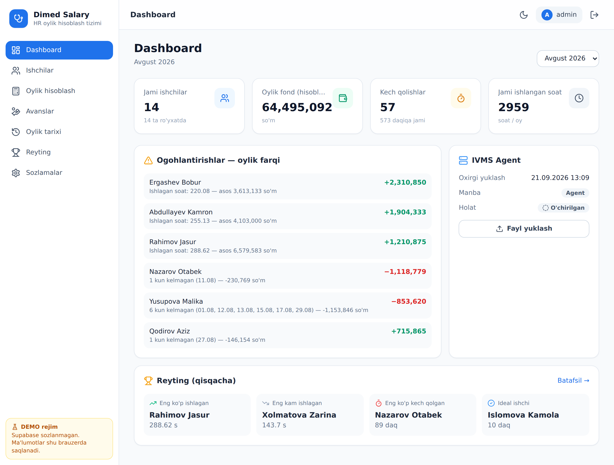
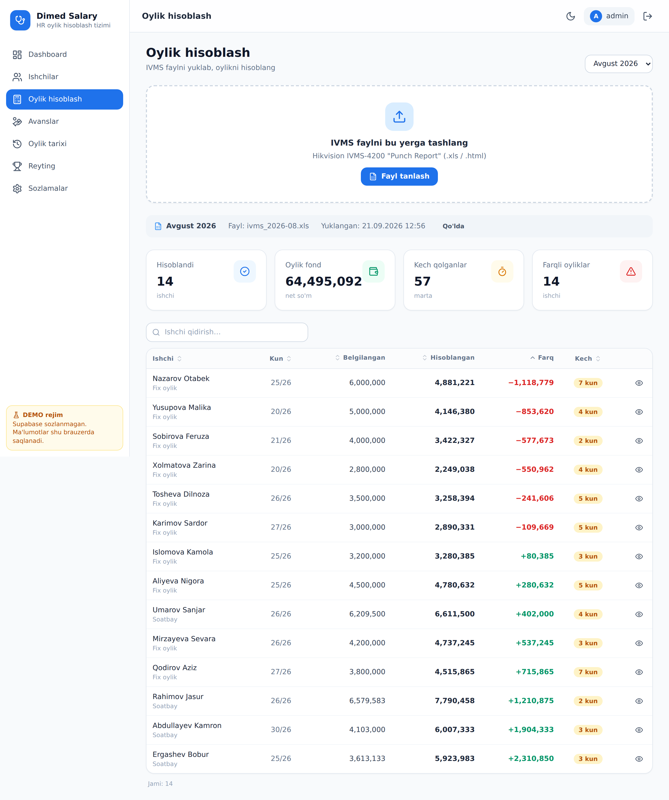
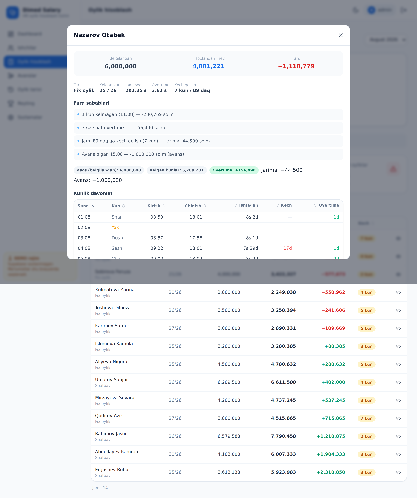
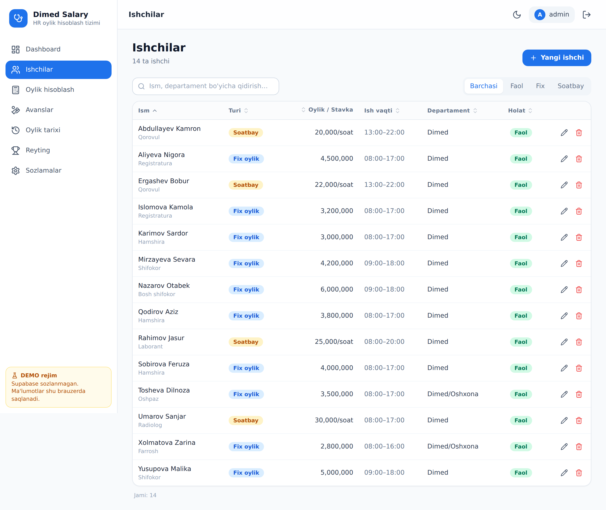
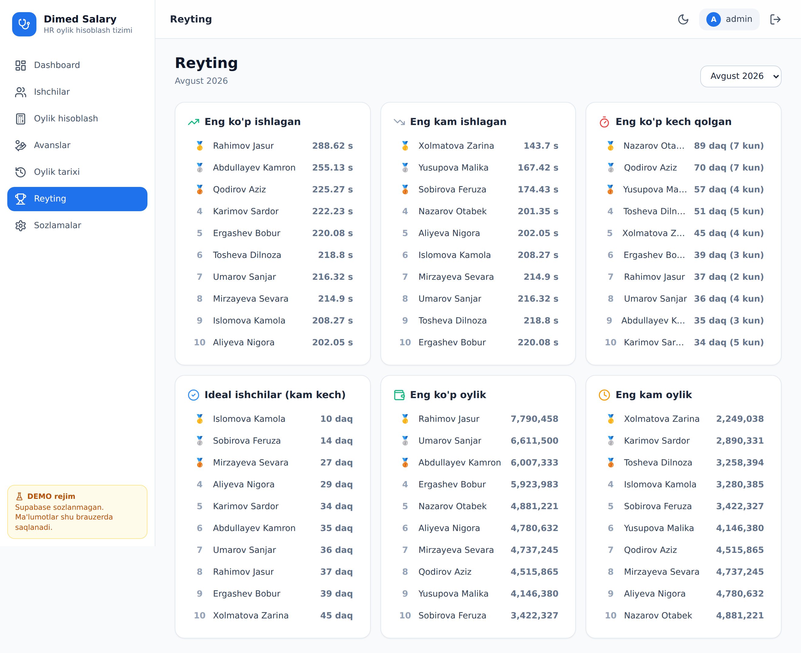
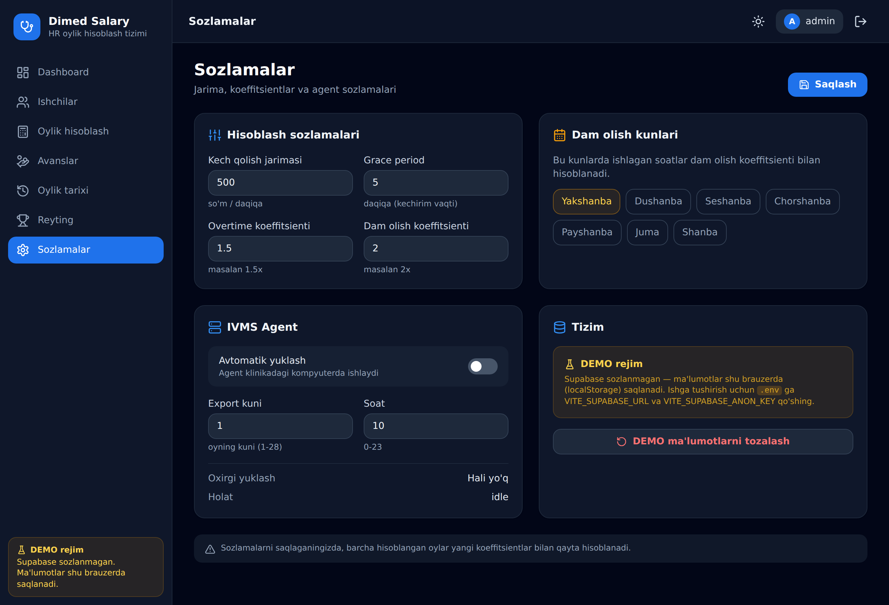
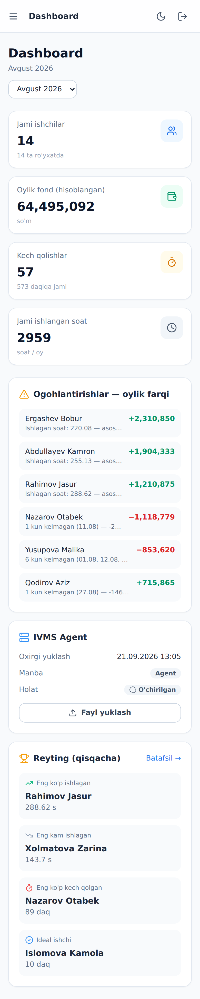

# Dimed Salary — HR oylik hisoblash tizimi

Dimed klinikasi uchun to'liq HR oylik hisoblash tizimi. Hikvision **IVMS-4200**
davomat hisobotini yuklab, har bir ishchi uchun oylikni avtomatik hisoblaydi —
kech qolish, overtime, dam olish kuni, avans va **belgilangan vs hisoblangan
oylik farqini batafsil sabablari bilan** ko'rsatadi.



---

## ✨ Imkoniyatlar

- 🔐 **Custom login** — nickname + parol (`.env` da 3 ta foydalanuvchi)
- 📊 **Dashboard** — oylik statistika, ogohlantirishlar, agent statusi, mini reyting
- 👥 **Ishchilar CRUD** — fix oylik yoki soatbay, individual ish vaqti va tushlik
- 📥 **IVMS parser** — Hikvision "Punch Report" (HTML-xls) ni o'qiydi, bitta
  qatordagi bir nechta yozuvni ham to'g'ri ajratadi (11-ustunlik chunking)
- 🧮 **Oylik hisoblash** — kech qolish (grace + jarima), overtime, dam olish
  koeffitsienti, avans; **farq sabablari** batafsil yoziladi
- 💸 **Avanslar** — individual avans, oylikdan avtomatik ushlab qolinadi
- 📅 **Oylik tarixi** — oyma-oy solishtirish (trend grafik), Excel export
- 🏆 **Reyting** — eng ko'p/kam ishlagan, kech qolgan, ideal ishchilar, oylik
- ⚙️ **Sozlamalar** — jarima, koeffitsientlar, dam olish kunlari, agent
- 🤖 **IVMS Agent** — klinika kompyuteriga o'rnatiladigan Python skript, oyning
  belgilangan kunida reportni avtomatik Supabase Storage ga yuklaydi
- 🌗 **Dark / light mode**, 📱 **mobil-friendly**, 🇺🇿 **o'zbekcha interfeys**

---

## 🖼 Skrinshotlar

| Oylik hisoblash | Farq sabablari |
|---|---|
|  |  |

| Ishchilar | Reyting |
|---|---|
|  |  |

| Sozlamalar | Mobil ko'rinish |
|---|---|
|  |  |

---

## 🛠 Texnologiyalar

| Qatlam | Texnologiya |
|---|---|
| Frontend | React 18 + Vite |
| Styling | Tailwind CSS (dark/light) |
| DB / Backend | Supabase (free tier) |
| Grafik | Recharts |
| Excel | SheetJS (xlsx) |
| Auth | Custom (nickname + parol, `.env`) |
| Deploy | Netlify |
| Agent | Python 3 |

---

## 🚀 Tez boshlash (DEMO rejim)

Supabase sozlanmagan bo'lsa, ilova avtomatik **DEMO rejimda** ishlaydi —
ma'lumotlar brauzerda (localStorage) saqlanadi va 14 ta namunaviy ishchi bilan
to'liq sinab ko'rsa bo'ladi.

```bash
git clone https://github.com/santyx-afk/avtoxisobchidimed.git
cd avtoxisobchidimed
npm install
npm run dev
```

Brauzerda `http://localhost:5173` — DEMO kirish: **admin / admin**

`sample/ivms_2026-08.xls` faylini "Oylik hisoblash" sahifasiga tashlab,
parser va hisoblashni sinab ko'ring.

---

## 🗄 Supabase sozlash (ishlab chiqarish)

1. [supabase.com](https://supabase.com) da bepul loyiha yarating.
2. **SQL Editor** da `supabase/schema.sql` faylini ishga tushiring (jadvallar,
   RLS, storage bucket avtomatik yaratiladi).
3. **Settings → API** dan `Project URL` va `anon public` kalitni oling.
4. `.env` faylini yarating (`.env.example` dan nusxa oling):

```env
VITE_USERS=admin:parol1,buxgalter:parol2,direktor:parol3
VITE_SUPABASE_URL=https://xxxx.supabase.co
VITE_SUPABASE_ANON_KEY=eyJhbGci...
VITE_IVMS_BUCKET=ivms-reports
```

> **Xavfsizlik:** ilova custom login ishlatadi (Supabase Auth emas), shuning
> uchun `schema.sql` anon kalit uchun ochiq RLS siyosati qo'yadi. Bu ichki
> klinika vositasi — kalitlarni maxfiy saqlang. Ko'proq xavfsizlik kerak bo'lsa
> Supabase Auth ga o'tishni ko'rib chiqing.

---

## 🌐 Netlify ga deploy

1. Netlify da repozitoriyni ulang.
2. Build sozlamalari `netlify.toml` da tayyor:
   - Build command: `npm run build`
   - Publish directory: `dist`
3. **Site settings → Environment variables** da yuqoridagi `VITE_*`
   o'zgaruvchilarni qo'shing.
4. Deploy — bepul Netlify domeni beriladi.

---

## 📄 IVMS fayl formati

Hikvision IVMS-4200 → **Punch Report** → HTML-xls sifatida eksport qilinadi.
Struktura:

```
Row 0: "Dimed"
Row 1: "Отчет о записях первого/последнего доступа"
Row 2: "2026-08-01 00:00:00 - 2026-08-31 23:59:59"
Row 3: №, Идентификатор человека, Имя, Департамент, Должность, Пол, Дата,
       День недели, Расписание, Первый вход, Последний выход
Row 4+: ma'lumotlar
```

Parser (`src/lib/ivmsParser.js`) barcha katakchalarni tekislaydi va **11 ustunlik
chunklarga** bo'ladi — bu bitta `<tr>` ichida bir nechta yozuv kelgan holatni ham
to'g'ri hal qiladi. Ishchilar IVMS dagi **ism** bo'yicha moslanadi.

---

## 🧮 Hisoblash mantig'i

`src/lib/salaryCalc.js` har bir ishchi uchun:

1. **Ish soatlari** = chiqish − kirish − tushlik
2. **Kech qolish** = kirish − ish boshlanishi − grace; jarima = daqiqa × narx
3. **Overtime** = ish tugashidan keyingi soatlar × koeffitsient (default 1.5×)
4. **Dam olish kuni** ishlagan soatlar × koeffitsient (default 2×)
5. **Avans** oylikdan ushlab qolinadi

**Fix oylik:** `kunlik = oylik / ish_kunlari`; kelgan kunlarga ko'paytiriladi.
**Soatbay:** ishlagan soatlar × stavka.

Natijada har bir ishchi uchun **farq sababi** yoziladi, masalan:

```
Belgilangan: 6,000,000 | Hisoblangan: 4,881,221 | Farq: −1,118,779
  • 1 kun kelmagan (11.08) — -230,769 so'm
  • 3.62 soat overtime — +156,490 so'm
  • Jami 89 daqiqa kech qolish (7 kun) — jarima -44,500 so'm
  • Avans olgan 15.08 — -1,000,000 so'm
```

---

## 🤖 IVMS Agent (avtomatik yuklash)

Klinika kompyuteriga o'rnatiladigan Python skript. Har oyning belgilangan
kunida oldingi oy reportini Supabase Storage ga yuklaydi; sayt ochilганda
faylni avtomatik ko'rib hisoblaydi.

To'liq qo'llanma: [`agent/README.md`](agent/README.md)

```bash
cd agent
# config.example.json -> config.json ni to'ldiring
# Windows: install.bat ni ikki marta bosing
python ivms_agent.py --now    # darhol sinash
```

---

## 📁 Loyiha tuzilishi

```
├── src/
│   ├── lib/
│   │   ├── ivmsParser.js      # IVMS HTML-xls parser (+ testlar)
│   │   ├── salaryCalc.js      # oylik hisoblash dvigateli (+ testlar)
│   │   ├── runCalculation.js  # parse -> moslashtirish -> saqlash
│   │   ├── db.js              # ma'lumot qatlami (Supabase | DEMO)
│   │   ├── excel.js           # Excel export
│   │   └── agentStorage.js    # agent fayllarini avtomatik sync
│   ├── components/            # UI (DataTable, Modal, SalaryDetail, ...)
│   └── pages/                 # Dashboard, Employees, Calculate, ...
├── supabase/schema.sql        # DB sxemasi + RLS + storage
├── agent/                     # Python IVMS agent + installer
├── sample/ivms_2026-08.xls    # namunaviy IVMS fayl
└── netlify.toml               # Netlify config
```

---

## 🧪 Testlar

Parser va hisoblash mantig'i uchun unit testlar (Vitest):

```bash
npm test
```

```
✓ src/lib/ivmsParser.test.js  (9 tests)
✓ src/lib/salaryCalc.test.js  (10 tests)
```

---

## 📦 Skriptlar

| Buyruq | Vazifa |
|---|---|
| `npm run dev` | Dev server |
| `npm run build` | Production build |
| `npm run preview` | Build ni ko'rish |
| `npm test` | Testlar |
